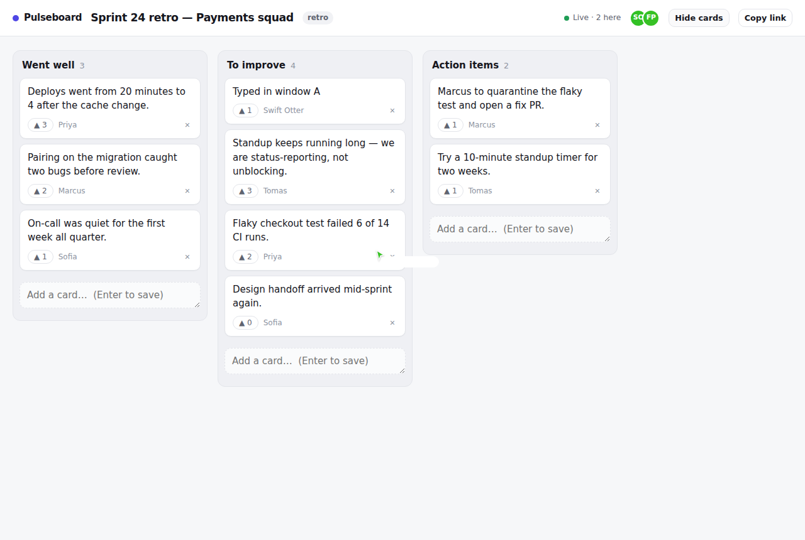

# Pulseboard

Real-time retro and kanban boards. Open the same URL in two windows, drag a card,
and it lands in both — cursors, votes and all. No signup: the link is the room.

**[Run it in one command](#running-it)** — the demo board seeds itself, so there is
something to look at the moment it boots.

> Deployed somewhere? Put the URL here; the landing page's *Open the demo board*
> button is the one-click entry point.



---

## The hard part

Everything else here is CRUD. The interesting question is the one you hit about
thirty seconds into building a collaborative board:

> **Two people drag the same card at the same moment. What happens?**

Most tutorials answer "last write wins" and move on, which in practice means one
person's drag silently undoes the other's while both screens show something
different. Pulseboard answers it in three parts.

### 1. Positions are fractional indexes, not integers

A card's place in a column is a base-62 string compared lexicographically, not a
`position` integer. To drop a card between `"a1"` and `"a3"` the server mints
`"a2"` — and writes **one row**.

The integer alternative (`UPDATE cards SET position = position + 1 WHERE position >= 4`)
rewrites the whole column on every move, so two concurrent drops collide on rows
neither person touched. With fractional indexes, two people moving *different*
cards never contend at all.

`src/ordering.ts` is the whole implementation, with the awkward part — an insert
at the very front, repeatedly, without keys collapsing to nothing — covered by
tests that split the same gap 200 times and prepend 500 times.

#### The bug that only showed up in CI

That design has a dependency it does not announce: the keys are compared
**byte-wise**. JavaScript does that natively, so the client sorts
`'0' < 'V' < 'l'`. Postgres does not, unless you tell it to — a `text` column
inherits the database's default collation, and under a linguistic locale such
as `en_US.UTF-8` the comparison is case-insensitive at the primary level, so
`'l' < 'V'`.

Client and server then disagree about the order of the cards, and
`WHERE sort_key > $1` — which is how a move finds the card adjacent to its drop
point — returns the wrong row or none at all.

The tests passed locally for twenty consecutive runs and failed on the first CI
run, because my machine's Postgres was `C.UTF-8` and the stock `postgres:16`
image is `en_US.UTF-8`. The fix is one line per column:

```sql
ALTER TABLE cards ALTER COLUMN sort_key TYPE text COLLATE "C";
```

`migrations/002_sort_key_collation.sql`, with a regression test that asserts
both the declared collation and that Postgres and JavaScript agree on the order
of `['0V', 'A', 'G', 'V', 'a', 'l', 'z']`.

### 2. Only one end of the drop is trusted

The browser says "put this card between A and B". By the time that message
arrives, B may have moved to another column and someone else's card may already
be sitting in the gap. So the server trusts **one** anchor and re-reads the other
bound from the table under a row lock:

```ts
// src/boards.ts
const above = anchorKey(input.beforeId);   // "after card A", as the client saw it
beforeKey = above;
afterKey  = await boundAbove(above);       // whatever is actually next, right now
```

Taking *both* bounds from the client is what makes two simultaneous drops into
the same gap mint the same key. The test
`two people dropping different cards into the same gap both succeed` fails
against that naive version and passes against this one.

If the anchor itself vanished mid-drag, the drop degrades to the bottom of the
column instead of erroring. A drag that ends in a dialog box is a worse bug than
a card landing one row off.

### 3. Same card, same moment → the loser is told, and snaps back

Every card carries a `version`. A move or edit sends the version the client had
when it picked the card up:

```
Alice: move card#7 (version 3) → In progress     ✅ becomes version 4
Bob:   move card#7 (version 3) → Done            ❌ CONFLICT, here is version 4
```

Bob's client applied his drag optimistically, so it already looks moved. The
rejection carries the authoritative card, his optimistic state is replaced by it,
and the card animates back to where Alice put it with a "Someone else moved that
card first" toast. No refresh, no silent divergence.

**Votes deliberately skip all of this.** They commute — two people voting at the
same instant is not a conflict, it is two votes — so `toggleVote` has no version
guard and no rollback. Knowing which operations *need* concurrency control is
most of the work; adding it everywhere is just latency.

### And one thing that is not concurrency

Retro boards hide cards until everyone has written theirs. That masking happens
in `toCard()` **on the server** — a hidden card's text is never sent to another
client. Masking in CSS or in the client store is one devtools inspection away
from being useless, which rather defeats the point of a blind retro.

## Try the concurrency story yourself

1. Open the demo board in two windows, side by side.
2. Drag the same card to different columns in each window at roughly the same
   time. One lands; the other snaps back with a toast.
3. Drag *different* cards into the same gap simultaneously. Both land, in a
   stable order, in both windows.
4. Hit **Hide cards** in one window and inspect the other window's DOM. The text
   is not there.

## Stack

| | |
|---|---|
| Server | Node 22, TypeScript, Express |
| Realtime | Socket.IO (acks for mutations, fire-and-forget for cursors) |
| Storage | Postgres 16, raw SQL, no ORM |
| Client | Server-rendered EJS + ~450 lines of vanilla JS, no build step |
| Deploy | Docker → Fly.io or Railway |

Presence and cursors are in-memory per process — they are worthless a second
after you disconnect. Everything else is in Postgres. Running more than one
instance would need a Socket.IO Redis adapter; at this size it does not.

## Running it

```bash
docker compose up          # http://localhost:3000, demo board seeded
```

Or against your own Postgres:

```bash
cp .env.example .env       # point DATABASE_URL at a database
npm install
npm run migrate && npm run seed
npm run dev
```

## Tests

```bash
createdb pulseboard_test
echo "DATABASE_URL=postgres://localhost:5432/pulseboard_test" > .env.test
npm test
```

The suite is 33 tests in three groups: property-ish tests for the ordering
algorithm (random interleaved inserts must never break lexicographic order or
mint a duplicate), and integration tests that run genuinely concurrent moves
through `Promise.all` against real Postgres to check that exactly one wins and
the loser is handed the authoritative card.

## Deploying

One click on Render — there is a `render.yaml` that creates the database and
the web service together. Railway and Fly.io instructions are in
[DEPLOY.md](DEPLOY.md).

The app boots with nothing but `DATABASE_URL`: migrations run on startup and
the demo data seeds itself, so a fresh deploy has something to look at
straight away.

Migrations run on boot, so there is no separate release step. `min_machines_running = 1`
is set because suspending a machine drops its WebSockets.

## Shortcuts taken

Worth naming, since a portfolio project that claims to be finished is lying:

- **Anyone with the link can edit.** Boards are unlisted random slugs; that is
  the whole access model. Fine for a retro, not for anything private.
- **Drag and drop is HTML5 DnD**, so it is mouse-only. Touch needs a pointer-event
  implementation.
- **Single process.** Presence lives in memory; horizontal scaling needs the
  Redis adapter.
- **No history.** Deleting a card deletes it, and deleting a column takes its
  cards with it.

## Licence

MIT
