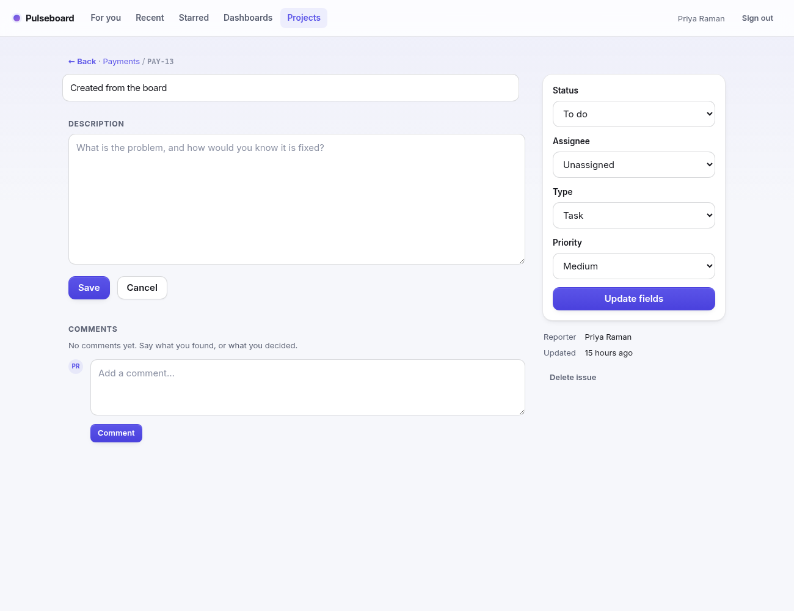

# Pulseboard

A light issue tracker. Projects, issues and a board you can drag — without the
forty screens of configuration.

**[Run it in one command](#running-it)** — the demo workspace seeds itself with
two projects, a fortnight of issues and a conversation on one of them, so there
is something real to look at the moment it boots.



---

## What it is

| | |
|---|---|
| `/for-you` | What is assigned to you, your projects, where you left off |
| `/recent` | Projects and issues you opened, newest first |
| `/starred` | Things you pinned, so a link is never lost |
| `/dashboards` | Issue counts by status and priority, per project |
| `/projects/:key/board` | Drag issues across To do → In progress → In review → Done |
| `/projects/:key/backlog` | The list, and where new issues land |
| `/projects/:key/issues/:n` | Description, comments, and the fields in a sidebar |

Issues have a key (`PAY-14`), a type (task, bug, story), a status, a priority and
an assignee. Comments are attributed and timestamped, editable and deletable by
their author.

## The hard part

A tracker is mostly forms. The parts that are not are where two people collide,
and they need **different answers** — which is the interesting bit.

### Ordering: fractional indexes, not integers

An issue's place in a column is a base-62 string compared lexicographically, not
a `position` integer. Dropping between `"a1"` and `"a3"` mints `"a2"` and writes
**one row**. The integer alternative renumbers the whole column on every move, so
two concurrent drops collide on rows neither person touched.

`src/ordering.ts` is the whole implementation, with the awkward part — splitting
the same gap over and over without keys collapsing to nothing — covered by tests
that split it 200 times and prepend 500 times.

**The subtlety those keys depend on:** they are compared *byte-wise*. Postgres
only does that if you say so. A `text` column inherits the database collation,
and under a linguistic locale such as `en_US.UTF-8` the comparison is
case-insensitive at the primary level, so `'l' < 'V'` and the server silently
disagrees with the client about what order the issues are in. The columns are
pinned to `COLLATE "C"`. CI caught this on its first run, after the suite had
passed twenty times locally against a `C.UTF-8` database.

### Conflicts: a version guard, and a snap-back

Every issue carries a `version`. A drag or an edit sends the version the client
held when it started; a stale one is rejected **with the authoritative issue**,
so the optimistic UI puts the card back rather than quietly undoing someone
else's work.

The destination column is locked for the length of the transaction, and the
opposite bound of a drop is re-read from live adjacency rather than trusted from
the browser. Taking both bounds from the client is what lets two simultaneous
drops into the same gap mint the same key — there is a test that fails against
that naive version and passes against this one.

### Issue numbers: same problem, different answer

`PAY-14` must exist exactly once. It cannot be a fractional index, and it cannot
be `max() + 1`, which races. The counter lives on the project row and is
incremented inside the insert transaction. A test fires eight concurrent filings
and asserts the numbers come back 1–8: no duplicates, no gaps.

### Delete is not dismiss

Removing something from Recent is not deleting it. Two controls that look alike
and destroy different amounts of work is the sort of thing people discover once,
badly — so they are kept visibly distinct, and a test asserts that a dismissed
entry leaves the underlying record intact.

## Stack

| | |
|---|---|
| Server | Node 22, TypeScript, Express |
| Storage | Postgres 16, raw SQL, no ORM |
| Client | Server-rendered EJS, a little vanilla JS for drag and drop |
| Deploy | Docker → Render, Railway or Fly.io |

No frontend framework and no build step for the client. Assets carry a content
fingerprint and are served immutable, so a deploy can never serve fresh HTML
against a stale stylesheet.

## Running it

```bash
docker compose up          # http://localhost:3000, demo workspace seeded
```

Or against your own Postgres:

```bash
cp .env.example .env
npm install
npm run migrate && npm run seed
npm run dev
```

Demo account: `demo@pulseboard.dev` / `demo-password`, or press the button on
the landing page.

## Tests

```bash
createdb pulseboard_test
echo "DATABASE_URL=postgres://localhost:5432/pulseboard_test" > .env.test
npm test
```

43 tests. The ordering ones are property-ish — random interleaved inserts must
never break lexicographic order or mint a duplicate. The rest run against real
Postgres, including genuinely concurrent drags and filings through
`Promise.all`, because a race test that does not actually race proves nothing.

The suites share a database and truncate between cases, so the runner is pinned
to one file at a time.

## Deploying

One click on Render — `render.yaml` creates the database and the web service
together. Railway and Fly.io are in [DEPLOY.md](DEPLOY.md). Migrations run on
boot and the demo data seeds itself.

## History

This started as a real-time retro board — anonymous rooms, live presence cursors
and server-side masking over Socket.IO — and the ordering and conflict machinery
above came from there. That half was removed to make the product one thing
instead of two; the code is still in the repo's history if you want to read it.

## Shortcuts taken

Worth naming, since a portfolio project that claims to be finished is lying:

- **No sprints, story points or workflows.** Statuses are fixed.
- **No activity history.** Comments are the only record of what changed.
- **Anyone signed in can view any project**; only members appear in assignee
  lists and only the lead can delete.
- **No search.** With a few hundred issues you would want it.
- **No attachments or rich text.** Descriptions and comments are plain text.

## Licence

MIT
